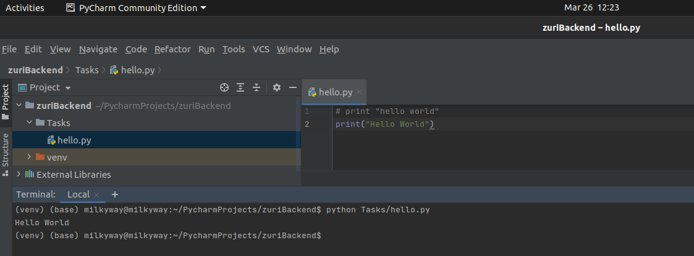
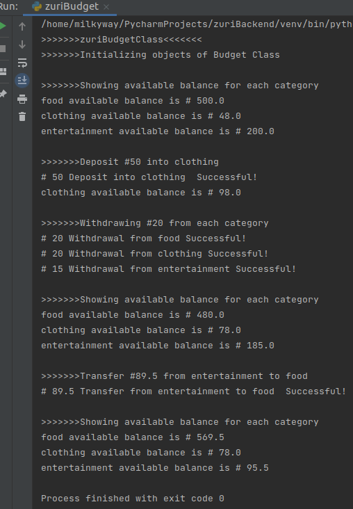

# zuriPythonBackend
## Task1
helloWorld
[Code](./helloWorld.py)

## Task2
[Code](./zuriATM.py)
## Task3 mock ATM updated with dB
[Code](./zuriATMv2.py)
## Task4 ZuriBudget
[Code](./zuriBudget.py)

<<<<<<< HEAD
## Task5 Django Setup
[Code](./Task5)
## Task6 CRUD Django task (adding more functionalities to the blog)
[Code](./Task6)
=======
>>>>>>> parent of 783f993... Task5
