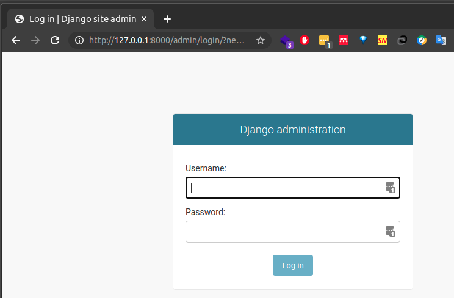

## Instructions
Following the Introduction to Django Session, Download and install python on your machine. When you do, create your first django project and also your first application,

Create a repo for it on Github and push the project there.
Submit the url to your github repo 

## Solution
```
cd zuriproject
python manage.py runserver
```
visit http://127.0.0.1:8000/zuriapp/index/ in your browser


visit http://127.0.0.1:8000/admin in your browser
un:milkyway pwd:zuri


## Steps
Run in Bash/CLI
```bash
pip install django
pip freeze
django-admin startproject zuriproject
cd zuriproject
python manage.py startapp zuriapp
cp zuriproject/urls.py zuriapp/
python manage.py migrate
python manage.py createsuperuser
python manage.py runserver
```

```
nano zuriapp/urls.py
```
confirm zuriapp/urls.py is the same as below
```python
from django.contrib import admin
from django.urls import path
from . import views

urlpatterns = [
    path('index/', views.index, name = "index")
]
```

```
nano zuriapp/views.py
```
confirm zuriapp/views.py is the same as below
```python
from django.shortcuts import render
from django.http import HttpResponse

# Create your views here.
def index(request):
    return HttpResponse("Welcome to Zuri App!!!")
```

```
nano zuriproject/urls.py
```
confirm zuriproject/urls.py is the same as below
```python
from django.contrib import admin
from django.urls import path, include

urlpatterns = [
    path('admin/', admin.site.urls),
    path('zuriapp/', include('zuriapp.urls'), name = '')
]
```

Add 'zuriapp' to INSTALLED_APPS variable in zuriproject/settings.py 
```
nano zuriproject/settings.py
```
```python
INSTALLED_APPS = [
    'django.contrib.admin',
    'django.contrib.auth',
    'django.contrib.contenttypes',
    'django.contrib.sessions',
    'django.contrib.messages',
    'django.contrib.staticfiles',
    'zuriapp',
]
```
