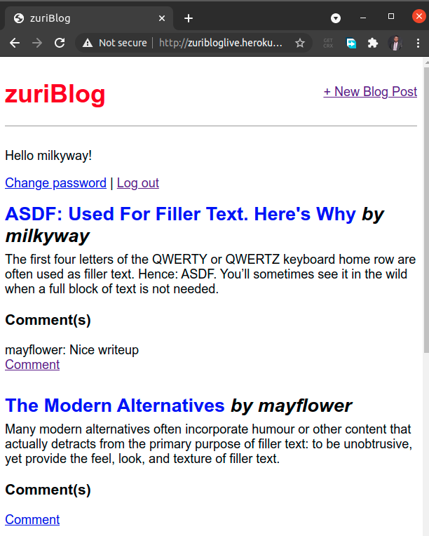

# Task6: CRUD Django task (adding more functionalities to the blog)
## Instructions
From your knowledge of Python and Django. Extend the blog we built with the following functionalities:

-    A register page (a new user can register, their details stored in a database file).
-    login (checks in the file and logs them in if they are already registered)
-    reset password
-    logout
-    A comment section, you must be logged in to comment
-    Host the project on heroku

#### Submission
To submit this task;

-    create a repository on your github profile
-    push your work to this repository
-    submit the link to your repo
-    Your readme should be well documented and contain link to the hosted site.

You will be graded on these 6 features. You get 2 marks each for each feature that works. Extra 2 marks for those who wrote test

GOOD LUCK!!!

## Solution
### About zuriBlog
[zuriBlog](https://zuribloglive.herokuapp.com/) is a blogging website based on python Django framework.

### Feature Checklist
- [x] User registration/signup page
- [x] Login
- [x] Logout
- [x] Change password  
- [x] Reset password
- [x] Comment section
- [x] Post detail
- [x] Post creation
- [x] Post modification
- [x] Post delete
- [x] Host on heroku
- [x] Test Driven Development

### Heroku
<https://zuribloglive.herokuapp.com/>

### Repo
<https://github.com/omodolapovictorb/zuriBlog>

### Todo
- [ ] Bootstrap styling